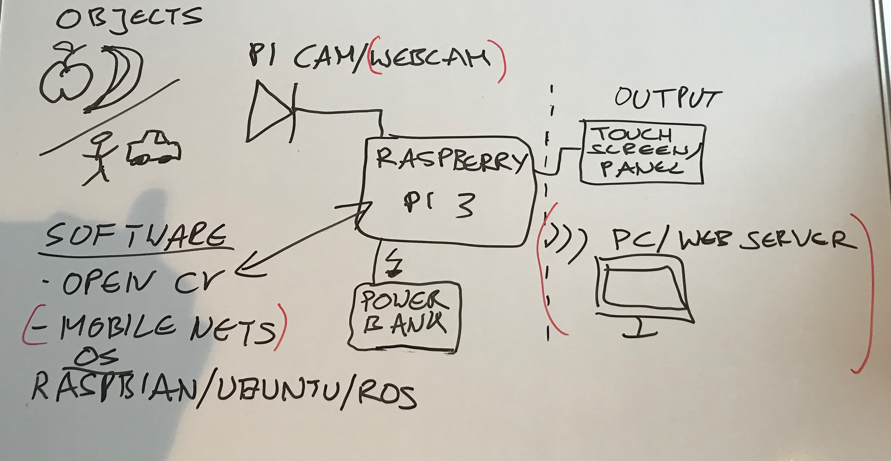
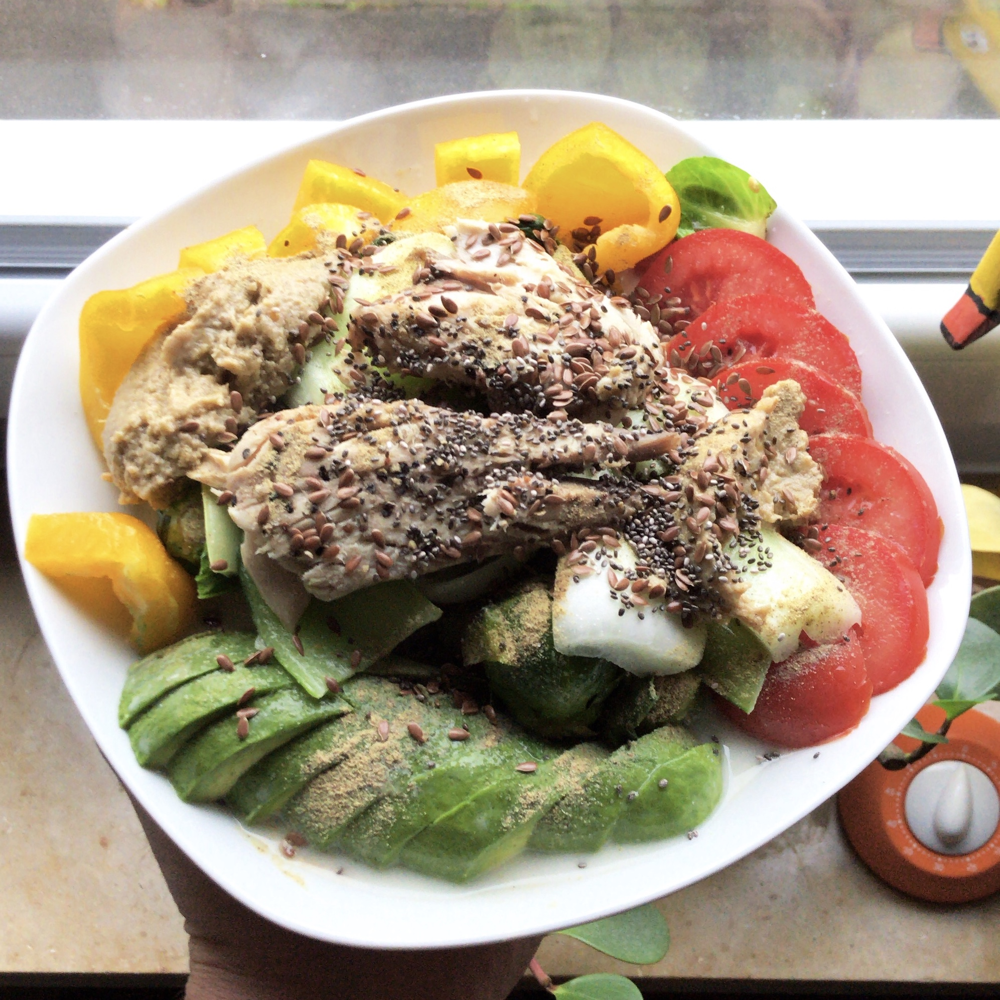

# SAPiObjectDetection

Portable and demonstrative Food recognizer & Object Detection system on Raspberry Pi 3

### Overview
<p align="center">
  
</p>

Minimal requirements:
  * [x] Supply -> Powerbank
  * [x] OS -> Raspbian
  * [x] Output -> LCD 3.5 inch screen
  * [x] Input -> Pi Camera
  * [ ] Software -> Nanonet?, PyImageSearch?

### How to do

#### OS

1) [Download Raspbian Desktop](https://www.raspberrypi.org/downloads/raspbian/) and unzip it
2) [Flash SD Card](https://www.raspberrypi.org/documentation/installation/installing-images/linux.md)

```
fdisk -l # (for me: /dev/mmcblk0)
cd Downloads
sudo dd bs=4M if=2018-11-13-raspbian-stretch-full.img of=/YOUR/SDCARD conv=fsyncsudo fdisk -l /dev/mmcblk0
```

3) Plug SD Card into Raspberry Pi 3, boot it up and run:  

```
sudo apt-get update
sudo apt-get upgrade
```

#### Input

* [Setup pi camera](https://thepihut.com/blogs/raspberry-pi-tutorials/16021420-how-to-install-use-the-raspberry-pi-camera)
  
#### Output

* [Install LCD Screen](https://github.com/goodtft/LCD-show)


#### Software

* PyImageSearch
  * [OpenCV](https://www.pyimagesearch.com/2018/09/26/install-opencv-4-on-your-raspberry-pi/)
  * [Object Detection](https://www.pyimagesearch.com/2017/10/16/raspberry-pi-deep-learning-object-detection-with-opencv/)
  * [Face Recognition](https://www.pyimagesearch.com/2018/06/25/raspberry-pi-face-recognition/)
* [Tensorflow](https://www.makeuseof.com/tag/image-recognition-tensorflow-raspberry-pi/)
* [Google Vision API](https://cloud.google.com/vision/)
* [Nanonet]()

### Goal

<p align="center">
  
</p>

Label: Buddha Bowl

### Other Sources

[ROS](https://roboticsweekends.blogspot.com/2017/12/how-to-install-ros-on-raspberry-pi-2-or.html)  
